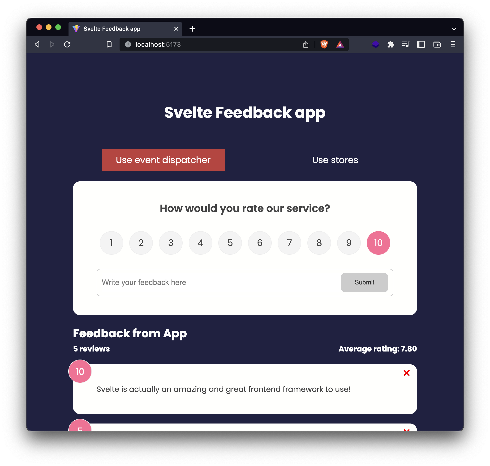

# Svelte Feedback app



A typical feedback app using Svelte framework. This is the extended version of Traversy Media's <a href="https://www.youtube.com/watch?v=3TVy6GdtNuQ" target="_blank">Svelte Crash Course</a>, with an option to switch between using `Event dispatcher` version or using `Stores` version. This project is created with Vite.

# Getting started
Install and run the app locally

```
yarn install
yarn run dev
```

# Connections

* <a href="https://hoangdesu.com/" target="_blank">Personal website</a>
* <a href="https://www.linkedin.com/in/hoangdesu/" target="_blank">LinkedIn</a>
* <a href="https://www.facebook.com/Hoangdayo/" target="_blank">Facebook</a>
* <a href="mailto:hoangdesu@gmail.com" target="_blank">Email</a>